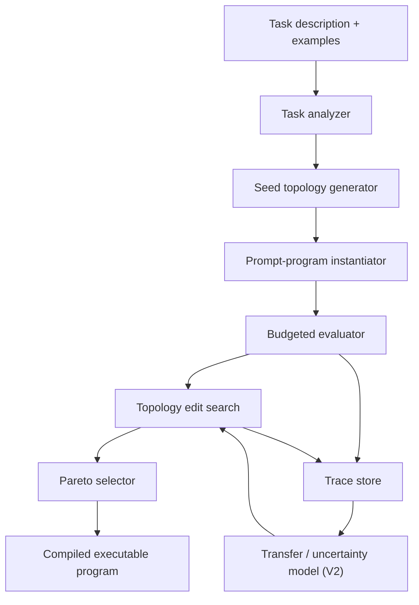

# TopoPrompt Implementation Blueprint

## 0. Paper Narrative

### 0.1 Abstract draft

TopoPrompt is a compiler for automatic prompt-program optimization in black-box large language model settings. Given a task description, a small set of examples, and a fixed API budget, it discovers typed prompt-program topologies rather than merely optimizing prompts within a user-defined structure. The system searches over staged, verified, and routed prompt programs under a minimality-aware objective and returns the smallest effective program among candidates near the best observed performance. TopoPrompt is designed to sit on top of existing LM runtimes such as DSPy, while keeping its own typed IR, search loop, and runtime traces for structure discovery. Across heterogeneous reasoning, factual, and instruction-following benchmarks, the intended claim is that automatic topology discovery improves over fixed-topology prompt optimization under the same budget while producing cheaper and more interpretable deployments.

### 0.2 Main claims

The paper should make three primary claims:

1. TopoPrompt optimizes **program structure**, not just prompt text inside a fixed structure.
2. TopoPrompt selects the **smallest effective** program under a formal performance-cost-complexity objective.
3. TopoPrompt can compile readable, deployable prompt programs automatically from raw task descriptions and examples.

### 0.3 Reviewer-facing novelty statement

TopoPrompt is not just another multi-step prompting system, another branching prompt optimizer, or another prompt tuner over a fixed LM pipeline. Its distinct contribution is the combination of typed topology discovery, task-driven seed initialization, budgeted search, and a minimality-aware final selector. In reviewer terms, the system must demonstrate that structure should be treated as an optimization variable, that this can be done automatically from raw task specifications, and that the result is not merely higher-scoring but also smaller and more deployable than more complex alternatives.

## 1. Purpose

This document is the build specification for **TopoPrompt**.

TopoPrompt is a compiler that takes:

- a task description
- a small set of examples
- a fixed API budget

and outputs:

- the **smallest effective prompt program**
- with readable routing behavior
- compiled into a deployable runtime
- with optional transfer and uncertainty support

The central research claim is:

> Existing prompt optimization systems mostly optimize prompts **inside** a fixed user-defined structure. TopoPrompt automatically discovers and compiles the **program structure itself**.

This document is intentionally implementation-heavy. It is written so you can build a working V1 first, then layer in the harder research components.

---

## 2. Final Product Definition

### 2.1 What TopoPrompt should do

Given:

- a natural-language task specification
- 5 to 200 training/development examples
- a target model or model family
- a compile budget

TopoPrompt should:

1. infer what kinds of reasoning/control-flow the task may need
2. generate a small set of candidate prompt-program topologies
3. instantiate each topology into executable prompt programs
4. evaluate them under a fixed budget
5. improve them through structure search and prompt-module edits
6. choose the best program under a **quality vs cost vs simplicity** objective
7. export the final program in a human-readable and machine-executable format

### 2.2 What TopoPrompt is not

TopoPrompt is not:

- another static prompt optimizer over flat strings
- a manual prompt engineering toolkit
- a human-authored branching library
- a new runtime framework that requires replacing DSPy or LangChain

TopoPrompt should sit **on top of** an existing LM runtime and act as a **compiler/optimizer layer**.

---

## 3. Core Thesis

### 3.1 One-line thesis

**TopoPrompt automatically compiles minimal prompt-program topologies from task descriptions and examples.**

### 3.2 Layering of the three source ideas

Use the original three ideas asymmetrically:

- **ProgPrompt** contributes the main novelty: prompt optimization as **program/topology discovery**
- **CPC** contributes the runtime shape: readable **conditional routing and execution**
- **BGPO** contributes the second-layer optimization engine: **transfer, uncertainty, and component-wise selection**

The paper is **not** "we combined three ideas."

The paper is:

> We compile deployable prompt programs from raw task descriptions by searching over structure, routing, and prompt modules under a budgeted objective.

---

## 4. Research Scope

### 4.1 V1 paper scope

V1 should prove three things:

1. TopoPrompt can discover a useful prompt-program topology automatically.
2. The discovered topology beats or matches strong static-prompt baselines under the same budget.
3. Among near-best candidates, TopoPrompt selects a **smaller**, cheaper, and more interpretable program.

### 4.2 V2 scope

V2 adds:

- transfer across tasks
- uncertainty-aware edit selection
- Bayesian priors over topology edits and prompt modules

### 4.3 Hard boundary for V1

Do not try to solve everything in V1.

V1 should use:

- small typed node vocabulary
- DAG-shaped prompt programs
- no loops
- no external tools except optional retrieval stubs
- bounded compile budget
- simple self-routing or classifier routing

This makes the system publishable and buildable.

---

## 5. Design Principles

1. **The user should not author topology.**
2. **Programs must be readable.**
3. **Search must be budget-aware.**
4. **Minimality is part of the objective, not an afterthought.**
5. **DSPy compatibility should lower adoption friction.**
6. **Every structural decision must be traceable in logs.**
7. **The optimizer should degrade gracefully to simple programs.**

---

## 6. Formal Problem Statement

Let:

- `T` be a task specification in natural language
- `E_compile` be the compile partition
- `E_fs` be the fixed few-shot pool carved out of `E_compile`
- `E_search` be the search partition, where `E_search = E_compile \ E_fs`
- `E_val` be the held-out validation partition used for finalist confirmation and minimality selection
- `E_test` be the held-out test partition used only for final reporting
- `M` be a black-box LLM API
- `B_call` be the compile-time budget measured in **single LLM invocations**
- `P` be a prompt program

We want to find:

`P* = argmax_P Utility(P | T, E_search, E_val, M, B_call)`

Where:

`Utility(P) = Perf(P) - alpha * Cost(P) - beta * Complexity(P)`

Use:

- `Perf(P)` = task metric on `E_val`
- `Cost(P)` = compile-time and inference-time cost
- `Complexity(P)` = description length or structural complexity

### 6.0.1 Canonical budget unit

The canonical compile budget unit in TopoPrompt is **one backend LLM invocation**.

That means:

- one node execution with `execution_mode = llm_call` costs `1`
- one parser-repair call costs `1`
- one analyzer call costs `1`
- one route call costs `1`
- one decompose subquestion solve subcall costs `1`

Candidate evaluation cost is therefore variable.

Recommended V1 accounting rule:

`EvalCost(P, X) = sum_{x in X} Invocations(P, x) + RepairCalls(P, x)`

Where `Invocations(P, x)` is the number of actual model calls made when running program `P` on example `x`.

This is why `screening_examples`, `narrowing_examples`, and `confirmation_examples` should be treated as **upper bounds on examples evaluated**, not guaranteed counts. The scheduler must stop evaluating a candidate shard when the remaining LLM-call budget would be exceeded.

### 6.1 Recommended selection rule

Use a two-stage selection rule:

1. Find the best achievable validation score under budget:

`best = max_P Perf(P)`

2. Among candidates whose score is within `epsilon` of `best`, choose the smallest:

`P* = argmin_{P: Perf(P) >= best - epsilon} DescriptionLength(P)`

This is the cleanest formulation of **smallest effective prompt program**.

Use a **variance-adaptive epsilon**, not a hard global constant.

Recommended V1 rule:

`epsilon = max(epsilon_floor, z * se_hat(best))`

Where:

- `epsilon_floor` prevents pathological over-tightening on very stable tasks
- `z` controls tolerance relative to uncertainty
- `se_hat(best)` is the estimated standard error of the best candidate on the current validation slice

Estimate `se_hat(best)` using:

- bootstrap resampling over examples
- repeated stochastic runs for finalists
- or binomial standard error when the metric is simple accuracy

This protects the minimality selector from chasing noise on small development slices.

### 6.2 Description length

For V1:

`DescriptionLength(P) = c_node * norm_V(|V|) + c_edge * norm_E(|E|) + c_branch * norm_B(BranchCount) + c_prompt * norm_T(PromptTokenCount)`

Where:

- `|V|` = number of nodes
- `|E|` = number of edges
- `BranchCount` = number of routed branches
- `PromptTokenCount` = total program prompt length across nodes

Each `norm_*` term should be scaled to `[0, 1]` using either:

- configured hard caps, or
- observed min/max values within the current candidate pool

Do not sum raw counts directly. In practice, raw `PromptTokenCount` will dominate unless you normalize the terms to comparable scales.

Before locking coefficients, run a calibration pass over a candidate archive and verify that no single term dominates the complexity score.

Later you can replace this with a more principled MDL formulation.

---

## 7. System Overview

TopoPrompt has six layers:

1. **Task ingestion**
2. **Program IR**
3. **Topology proposal**
4. **Budgeted search**
5. **Runtime execution**
6. **Transfer/uncertainty engine**

### 7.1 High-level pipeline



### 7.2 V1 execution cycle

1. Parse task spec and examples.
2. Infer likely task attributes.
3. Produce a small library of candidate seed programs.
4. Evaluate seeds on a small subset.
5. Search over topology edits and prompt-module edits.
6. Re-evaluate survivors on a larger subset.
7. Select the smallest effective program.
8. Export executable program plus trace report.

---

## 8. User Experience

### 8.1 Intended user API

The user should provide something as simple as:

```python
from topoprompt import compile_task

artifact = compile_task(
    task_description="Answer GSM8K math word problems accurately.",
    examples=train_examples[:32],
    model="gpt-4.1-mini",
    compile_budget=500,
)
```

Canonical ownership rule:

- if the caller provides only `examples`, `compile_task` is responsible for partitioning them into `E_fs`, `E_search`, and `E_val` using the configured split policy
- if the caller provides explicit partitions, the compiler must use those partitions as-is and skip internal repartitioning

This makes `E_fs` compiler-owned by default and removes ambiguity about who materializes the few-shot pool.

Output:

- `artifact.program_ir`
- `artifact.python_program`
- `artifact.dspy_program`
- `artifact.metrics`
- `artifact.compile_trace`

### 8.2 What the user should not do

The user should not need to:

- define branches
- write a DSL manually
- specify graph nodes
- hand-code routing rules
- choose search operators

That is the compiler's job.

---

## 9. Prompt Program Representation

### 9.1 Representation choice

Use a **typed DAG IR** in V1.

Why DAG first:

- easier to search than arbitrary graphs
- easier to execute
- easier to debug
- easier to export into DSPy-like pipelines
- enough to express most useful multi-call prompt flows

### 9.2 Core objects

The IR should include:

- `TaskSpec`
- `Example`
- `ProgramNode`
- `ProgramEdge`
- `PromptProgram`
- `ExecutionState`
- `ExecutionTrace`

### 9.3 Suggested node types for V1

Keep the vocabulary small:

1. `direct`
2. `plan`
3. `decompose`
4. `solve`
5. `verify`
6. `critique`
7. `route`
8. `format`
9. `finalize`

### 9.3.1 Critique node status

Keep `critique` in the IR, but treat it as **deferred to V1.5** unless an early benchmark clearly shows that explicit self-critique improves search.

For V1:

- support `critique` in schemas and validators
- do not require it in seed topologies
- do not require it in the MVP search operator set

This avoids confusing implementers into thinking `critique` is mandatory in the first prototype.

### 9.3.2 V1 core runtime vs late-V1 nodes

For implementation sequencing, distinguish between:

- **V1 core runtime nodes**: `direct`, `solve`, `verify`, `route`, `finalize`
- **late-V1 extension nodes**: `plan`, `decompose`, `format`
- **V1.5 node**: `critique`

This keeps Phase 1 small while still allowing `plan`, `decompose`, and `format` to join the full V1 compiler once the core runtime is stable.

Recommended V1 handling of formatting:

- use prompt modules and `finalize` for most formatting behavior in the MVP
- add standalone `format` nodes only after the core runtime and selector are stable

### 9.4 Node semantics

- `direct`: produce a candidate answer in one pass without explicit planning
- `plan`: produce a concise plan before solving
- `decompose`: break the task into subparts or subquestions
- `solve`: produce an intermediate or final solution
- `verify`: check consistency, constraint satisfaction, or correctness
- `critique`: diagnose errors in a candidate answer
- `route`: choose a branch or execution mode
- `format`: convert answer to required schema/output style
- `finalize`: emit the final output, usually as a deterministic sink/pass-through in V1

### 9.5 Route node semantics

In V1, `route` should support three modes:

1. `self_route_llm`
2. `rule_route`
3. `classifier_route`

Start with `self_route_llm` and `rule_route`.

### 9.6 Constraints on valid programs

V1 program constraints:

- graph must be acyclic
- exactly one entry node
- exactly one finalize node
- max nodes default: `7`
- max route nodes default: `2`
- max branch fanout default: `3`
- every node must feed forward toward finalize

These constraints are important. They prevent the search from exploding.

---

## 10. Data Model

Use Pydantic or dataclasses. Pydantic is better for config validation and artifact persistence.

### 10.1 Suggested schemas

```python
from __future__ import annotations

from enum import Enum
from typing import Any, Literal
from pydantic import BaseModel, Field


class NodeType(str, Enum):
    DIRECT = "direct"
    PLAN = "plan"
    DECOMPOSE = "decompose"
    SOLVE = "solve"
    VERIFY = "verify"
    CRITIQUE = "critique"
    ROUTE = "route"
    FORMAT = "format"
    FINALIZE = "finalize"


class TaskSpec(BaseModel):
    task_id: str
    description: str
    input_schema: dict[str, Any] = Field(default_factory=dict)
    output_schema: dict[str, Any] = Field(default_factory=dict)
    task_family: str | None = None
    metadata: dict[str, Any] = Field(default_factory=dict)


class Example(BaseModel):
    example_id: str
    input: dict[str, Any]
    target: Any | None = None
    metadata: dict[str, Any] = Field(default_factory=dict)


class PromptModule(BaseModel):
    role: Literal["system", "instruction", "reasoning", "verification", "format", "fewshot"]
    text: str
    tags: list[str] = Field(default_factory=list)
    origin: str = "generated"


class RouteSpec(BaseModel):
    mode: Literal["self_route_llm", "rule_route", "classifier_route"]
    branch_labels: list[str]
    branch_descriptions: dict[str, str] = Field(default_factory=dict)
    confidence_threshold: float | None = None
    fallback_branch: str | None = None


class ProgramNode(BaseModel):
    node_id: str
    node_type: NodeType
    name: str
    input_keys: list[str] = Field(default_factory=list)
    output_keys: list[str] = Field(default_factory=list)
    execution_mode: Literal["llm_call", "pass_through", "decompose_macro"] = "llm_call"
    expected_output_schema: dict[str, Any] = Field(default_factory=dict)
    parser_id: str = "json"
    fallback_parser_id: str = "regex_then_repair"
    prompt_modules: list[PromptModule] = Field(default_factory=list)
    route_spec: RouteSpec | None = None
    config: dict[str, Any] = Field(default_factory=dict)


class ProgramEdge(BaseModel):
    source: str
    target: str
    label: str | None = None


class PromptProgram(BaseModel):
    program_id: str
    task_id: str
    nodes: list[ProgramNode]
    edges: list[ProgramEdge]
    entry_node_id: str
    finalize_node_id: str
    metadata: dict[str, Any] = Field(default_factory=dict)
```

For most node types, `output_keys` will contain exactly one state key.

Examples:

- `direct` -> `["candidate_answer"]`
- `solve` -> `["candidate_answer"]`
- `verify` -> `["verification_result"]`
- `decompose` -> `["subquestions", "subquestion_answers", "decomposition_context"]`
- `finalize` -> `["final_answer"]`

`execution_mode`, `expected_output_schema`, `parser_id`, and `fallback_parser_id` make the serialized IR self-sufficient enough for runtime execution and export.

Recommended V1 defaults:

- `direct`: `execution_mode="llm_call"`
- `solve`: `execution_mode="llm_call"`
- `verify`: `execution_mode="llm_call"`
- `route`: `execution_mode="llm_call"`
- `decompose`: `execution_mode="decompose_macro"`
- `finalize`: `execution_mode="pass_through"` unless explicitly configured otherwise

### 10.2 Execution trace schema

```python
class NodeExecutionTrace(BaseModel):
    node_id: str
    prompt_text: str
    raw_output: str
    parsed_output: Any | None = None
    token_usage: dict[str, int] = Field(default_factory=dict)
    latency_ms: int | None = None
    route_choice: str | None = None
    confidence: float | None = None


class ProgramExecutionTrace(BaseModel):
    example_id: str
    program_id: str
    node_traces: list[NodeExecutionTrace]
    final_output: Any | None = None
    correctness: float | None = None
    total_tokens: int = 0
    total_latency_ms: int = 0
```

---

## 11. Program IR Serialization

Use JSON as the canonical stored form.

Also support:

- human-readable YAML export
- Python object export
- DSPy-compiled export

Recommended artifact files:

- `program.json`
- `program.yaml`
- `compile_trace.jsonl`
- `metrics.json`
- `summary.md`

---

## 12. Task Analyzer

### 12.1 Purpose

The task analyzer converts raw task description + examples into a compact planning object used by the compiler.

### 12.2 Required outputs

The task analyzer should infer:

- task family
- expected output format
- likely need for reasoning
- likely need for decomposition
- likely need for verification
- likely input heterogeneity
- likely route categories
- initial complexity budget

### 12.3 Example analyzer output

```json
{
  "task_family": "math_reasoning",
  "output_format": "short_answer",
  "needs_reasoning": true,
  "needs_verification": true,
  "needs_decomposition": false,
  "input_heterogeneity": "medium",
  "candidate_routes": [
    {
      "label": "direct_factoid",
      "description": "Use for direct factual or low-computation items."
    },
    {
      "label": "step_by_step_reasoning",
      "description": "Use for multi-step reasoning or arithmetic items."
    }
  ],
  "initial_seed_templates": [
    "direct_finalize",
    "plan_solve_finalize",
    "route_direct_or_solve_finalize"
  ]
}
```

### 12.4 How to implement it

Use a compile-time meta-prompt that sees:

- task description
- up to `k` representative examples
- target metric info

Then ask it to emit strict JSON.

Keep this analyzer cheap.

Recommended defaults:

- `k = 5`
- low temperature
- small fast model

The analyzer is not the final optimizer. It only provides priors.

### 12.4.1 Analyzer prompt template

Use a fixed analyzer prompt so compile behavior is reproducible across implementations.

Recommended system prompt:

```text
You are the TopoPrompt task analyzer.
Your job is to infer what prompt-program structures are plausible for a task.
You are not solving the task itself.
You must output strict JSON only.

Guidelines:
- Prefer simple structures unless the task clearly requires more.
- Recommend routing only when the input distribution appears heterogeneous.
- Recommend verification only when errors are costly or the task is constraint-heavy.
- Recommend decomposition only when the examples show multi-part reasoning.
- Keep the number of suggested seed templates small.
```

Recommended user prompt skeleton:

```text
Task description:
{task_description}

Metric:
{metric_name}

Representative examples:
{examples_json}

Available seed templates:
- direct_finalize
- plan_solve_finalize
- decompose_solve_finalize
- solve_verify_finalize
- route_direct_or_solve_finalize
- plan_solve_verify_finalize
- route_direct_or_plan_solve_finalize

Return JSON with these fields:
- task_family
- output_format
- needs_reasoning
- needs_verification
- needs_decomposition
- input_heterogeneity
- candidate_routes
- initial_seed_templates
- analyzer_confidence
- rationale
```

### 12.4.2 Analyzer output schema

Recommended strict output schema:

```json
{
  "task_family": "math_reasoning | factual_qa | instruction_following | code | mixed | other",
  "output_format": "short_answer | long_form | json | code | multiple_choice | other",
  "needs_reasoning": true,
  "needs_verification": true,
  "needs_decomposition": false,
  "input_heterogeneity": "low | medium | high",
  "candidate_routes": [
    {
      "label": "direct_factoid",
      "description": "Use for direct factual or low-computation items."
    }
  ],
  "initial_seed_templates": [
    "direct_finalize",
    "route_direct_or_solve_finalize"
  ],
  "analyzer_confidence": 0.73,
  "rationale": "Inputs mix direct and multi-step items."
}
```

Validation rules:

- `initial_seed_templates` must be a subset of the registered seed library
- `candidate_routes` length must be `0` to `3`
- `analyzer_confidence` must be in `[0, 1]`
- if `input_heterogeneity = low`, prefer no routing unless examples strongly suggest otherwise

If validation fails, retry once with a repair prompt. If it still fails, default to the full seed library with no analyzer prior.

### 12.5 Failure handling and re-seeding fallback

The task analyzer is a fragile early-stage component. A single bad analyzer call can poison the entire compile run if it causes the compiler to start from the wrong seeds.

To prevent that, V1 should always:

- include `direct -> finalize` as a sentinel seed
- keep the full seed library available for fallback
- log analyzer recommendations separately from actual winning seeds

Recommended fallback rule:

1. instantiate analyzer-ranked seeds plus the sentinel direct baseline
2. screen them on the first small shard
3. if all analyzer-ranked seeds underperform the sentinel by more than `reseed_margin`, or by more than one estimated standard error, discard the analyzer ranking
4. re-instantiate from the full seed library and continue search from there

Suggested starting value:

- `reseed_margin = 0.03 to 0.05` absolute accuracy, depending on task and shard size

This re-seeding trigger is a safety valve, not a failure. It keeps one weak analyzer call from wasting the whole budget.

---

## 13. Seed Topology Library

### 13.1 Why seeds matter

Pure topology search from scratch will be too expensive.

Start from a small fixed seed library and let the search mutate from there.

### 13.2 Recommended seed topologies

Implement these seeds:

1. `direct_finalize`: `direct -> finalize`
2. `plan_solve_finalize`: `plan -> solve -> finalize`
3. `decompose_solve_finalize`: `decompose -> solve -> finalize`
4. `solve_verify_finalize`: `solve -> verify -> finalize`
5. `route_direct_or_solve_finalize`: `route -> direct|solve -> finalize`
6. `plan_solve_verify_finalize`: `plan -> solve -> verify -> finalize`
7. `route_direct_or_plan_solve_finalize`: `route -> direct|plan_solve -> finalize`

### 13.3 Seed selection policy

The task analyzer should rank which seeds are plausible.

V1 policy:

- generate top `3` to `5` seeds only
- evaluate each quickly on a small slice
- discard obviously weak seeds early
- fall back to the full seed library when the analyzer-triggered seed set loses clearly to the sentinel direct baseline

---

## 14. Prompt Module Templates

### 14.1 Why prompt modules exist

You do not want every node prompt to be free-form from scratch.

Each node should be composed from typed prompt modules.

### 14.2 Module roles

Use these roles:

- `instruction`
- `reasoning`
- `verification`
- `format`
- `fewshot`

### 14.3 Example direct node

```python
[
    PromptModule(role="instruction", text="Answer the question accurately."),
    PromptModule(role="format", text="Return only the candidate answer."),
]
```

### 14.4 Example solve node

```python
[
    PromptModule(role="instruction", text="Solve the problem carefully."),
    PromptModule(role="reasoning", text="Work through the logic step by step, but keep it concise."),
    PromptModule(role="format", text="Output a candidate answer and a short rationale."),
]
```

### 14.5 Example verify node

```python
[
    PromptModule(role="verification", text="Check whether the candidate answer satisfies all constraints."),
    PromptModule(role="format", text="Return PASS or FAIL, followed by a short explanation."),
]
```

### 14.6 Template generation policy

For V1:

- keep a hand-written module bank
- allow the compiler to lightly rewrite modules with an LLM
- log all rewrites

Do not start with fully open-ended prompt generation everywhere.

### 14.7 Few-shot example selection

`add_fewshot_module` and `drop_fewshot_module` require an explicit source of few-shot examples.

In V1:

- create a fixed few-shot pool `E_fs` from a held-aside subset of the compile partition
- never draw few-shot examples from screening, narrowing, confirmation, validation, or test shards
- keep `E_fs` fixed for the entire compile run so comparisons remain reproducible
- the compiler owns `E_fs` creation unless the caller explicitly supplies pre-partitioned datasets

Recommended starting rule:

- `E_fs = min(10% of E_compile, 32 examples)`

When `add_fewshot_module` fires, it should sample or rank examples from `E_fs`, not from the active evaluation shard. This avoids contamination between prompt construction and candidate evaluation.

---

## 15. Runtime Semantics

### 15.1 Execution model

At inference time, the compiled prompt program runs over a single example.

Execution steps:

1. create initial execution state from input
2. start at entry node
3. inspect the node's `execution_mode`
4. if `execution_mode = "llm_call"`, render node prompt from state + modules, call the LLM, and parse the output into structured state
5. if `execution_mode = "pass_through"`, apply a deterministic state transform with no model call
6. if `execution_mode = "decompose_macro"`, run the bounded decompose subroutine and write its state outputs
7. follow outgoing edge or selected route branch
8. continue until finalize

### 15.1.1 Direct and finalize state contract

To keep `direct -> finalize` well-defined in V1:

- `direct` should usually write `candidate_answer`
- `solve` should usually write `candidate_answer`
- `verify` should usually write `verification_result`
- `finalize` should read from `candidate_answer`, `verification_result`, or another configured upstream key and write `final_answer`

Recommended V1 default:

- `finalize` is a deterministic sink/pass-through node with `execution_mode = "pass_through"`
- `finalize` may optionally apply simple formatting or winner-selection rules, but should not call the LLM unless explicitly configured otherwise

This keeps the runtime contract clean while preserving the seed library shape.

### 15.2 Execution state

Use a simple dictionary-like state:

```python
state = {
    "task_input": {...},
    "plan": ...,
    "subquestions": ...,
    "subquestion_answers": ...,
    "decomposition_context": ...,
    "candidate_answer": ...,
    "verification_result": ...,
    "final_answer": ...,
}
```

### 15.2.1 Decompose node execution in V1

`decompose` stays in V1, but it must be implemented in a bounded way.

In V1, a `decompose` node does **not** create arbitrary graph fan-out. Instead, it acts as an executor-managed macro:

1. the `decompose` node emits an ordered list of `subquestions`
2. the executor truncates that list to `max_subquestions_per_decompose`
3. for each subquestion, the executor runs one bounded subcall using the downstream `solve` behavior or a dedicated subquestion-solving template
4. the executor collects these outputs into `subquestion_answers`
5. the executor concatenates or summarizes them into `decomposition_context`
6. the downstream `solve` node receives the original input plus `decomposition_context`

Recommended V1 limits:

- `max_subquestions_per_decompose = 3`
- one solve subcall per subquestion
- simple ordered concatenation for `decomposition_context` before adding any learned aggregation

This keeps `decompose -> solve -> finalize` executable without requiring a full parallel graph scheduler in V1.

### 15.3 Parsing outputs

Require structured parsing for all nodes.

Each node should define:

- expected output schema
- parser
- fallback parser

Use JSON when possible.

### 15.3.1 Fallback parser protocol

The fallback parser must be explicitly defined because malformed JSON will occur often during search.

Use this sequence:

1. **primary parser**
   - attempt strict JSON parsing against the node schema
2. **regex/key extraction fallback**
   - if JSON parsing fails, extract the minimal required fields using deterministic regexes or delimiter-based parsing
   - example: recover `branch`, `confidence`, `answer`, `verdict`, or `final_answer`
3. **repair prompt**
   - if extraction is incomplete, send the raw output to a repair model with the original target schema and ask for corrected strict JSON
4. **parse-failed exception**
   - if repair still fails, raise a structured `ParseFailed` error and record it in the execution trace

Recommended repair prompt:

```text
Convert the following model output into valid JSON matching this schema.
Do not add information that is not present.
If a field is missing, set it to null.

Schema:
{target_schema}

Raw output:
{raw_output}
```

The fallback parser should never silently coerce malformed outputs into valid results without logging that a fallback path was used.

All repair-style operations in V1, including parser repair and analyzer JSON repair, should use `model.repair_model` when configured. If `model.repair_model` is `null`, fall back to `model.name`.

### 15.4 Failure handling

If a node output cannot be parsed:

1. retry once with a repair prompt
2. if still invalid, mark execution as parse-failed
3. record this in trace
4. optionally route to fallback branch if configured

Do not silently swallow parser failures.

---

## 16. CPC-Style Routing

### 16.1 Role of CPC here

CPC should contribute the idea that the final deployed program can include readable conditional logic.

### 16.2 Important rule

The user should not define this logic manually.

TopoPrompt should discover it during compile time.

### 16.3 Route node implementation

A route node receives:

- input features from task input or previous nodes
- branch descriptions
- optional routing prompt

It returns:

- `branch_label`
- `confidence`
- optional rationale

### 16.4 Route node prompt format

Example:

```text
You are selecting the best execution branch.

Available branches:
- direct_factoid: Use when the question can be answered directly from known facts.
- reasoning: Use when the question requires multi-step reasoning or arithmetic.

Input:
{task_input}

Return JSON:
{"branch": "...", "confidence": 0.0, "reason": "..."}
```

### 16.5 Route supervision

Where do route labels come from?

Use **induced supervision**:

1. run multiple branches on the same compile example from `E_search`
2. observe which branch performs best
3. assign that branch as the training label
4. use these labels for classifier-route models or route evaluation

This is important. It turns route selection into a learnable object.

### 16.6 Implementation timing for route induction

Do not leave route label induction until the end of the project.

As soon as beam search is operational and route-containing candidates exist, add induced-label generation and routing diagnostics.

Without induced labels, you cannot answer the two most important routing questions:

- did the route node choose the branch that actually helps?
- is the routing policy learning anything stable, or just adding control flow noise?

Treat route induction as part of the first usable search system, not a late-stage polish task.

---

## 17. Search Space

### 17.1 Search object

Search over:

- topology
- node types
- route placement
- route branches
- node prompt modules
- verifier placement
- format modules

In V1, node ordering changes only implicitly through insertion, deletion, replacement, and route-splitting edits. There is no standalone reorder operator in the initial edit set.

### 17.2 Edit operators

Implement these structural edits:

1. `add_node`
2. `delete_node`
3. `replace_node_type`
4. `insert_verify_after`
5. `insert_plan_before`
6. `split_with_route`
7. `remove_route`
8. `swap_branch_target`
9. `rewrite_prompt_module`
10. `add_fewshot_module`
11. `drop_fewshot_module`
12. `change_finalize_format`

### 17.3 Validity checks after every edit

Every edited program must pass:

- DAG validity
- no orphan nodes
- one entry node
- one finalize node
- branch labels align with route config
- output keys are available before use
- complexity cap not exceeded

Use a strict validator.

---

## 18. Search Algorithm

### 18.1 Recommended V1 algorithm

Use a **hybrid beam search + LLM-guided edit proposal + multi-fidelity evaluation**.

This is the most practical V1.

### 18.2 Why this algorithm

Pure genetic programming is expensive.
Pure brute force is impossible.
Pure LLM proposal is unstable.

A hybrid method gives you:

- structure prior from the analyzer and proposal model
- constrained edits
- budget control through beam width and multi-fidelity screening

### 18.3 Candidate generation

For each surviving program:

1. generate heuristic edits from the edit library
2. optionally ask an LLM to propose 1 to 3 plausible next edits
3. canonicalize and deduplicate
4. validate edited candidates

### 18.3.1 LLM-guided edit proposal interface

The LLM edit proposer is a bounded helper, not an unconstrained program synthesizer.

It should see:

- task analyzer summary
- current program summary
- recent evaluation diagnostics
- allowed edit operators
- hard structural constraints

Recommended system prompt:

```text
You are proposing the next structural edit for a prompt-program compiler.
You may only choose from the allowed edit operators.
Your goal is to improve validation performance without unnecessary complexity.
Prefer local edits over large rewrites.
Return strict JSON only.
```

Recommended user prompt skeleton:

```text
Task summary:
{task_summary}

Current program summary:
{program_summary}

Current diagnostics:
{diagnostics_summary}

Allowed edit operators:
{allowed_edits}

Hard constraints:
- graph must remain a DAG
- exactly one finalize node
- max nodes: {max_nodes}
- max route nodes: {max_route_nodes}
- max branch fanout: {max_branch_fanout}

Return 1 to 3 candidate edits in JSON.
```

Recommended output schema:

```json
{
  "proposals": [
    {
      "edit_type": "insert_verify_after",
      "target_node_id": "solve_1",
      "new_node_type": "verify",
      "module_role": null,
      "branch_labels": null,
      "rewrite_instruction": null,
      "reason": "Candidate answers are often wrong on arithmetic tasks."
    }
  ]
}
```

Mapping rules:

- `edit_type` must map exactly to a registered edit operator
- `target_node_id` must reference an existing node when the edit requires one
- `new_node_type` is required only for node-insertion or replacement edits
- `branch_labels` is required only for route-creation edits
- `rewrite_instruction` is required only for `rewrite_prompt_module`

If the LLM returns an invalid or unsupported edit:

- drop that proposal
- log the invalid proposal
- continue with heuristic edits only

This prevents the LLM proposer from becoming a hidden source of nondeterministic search behavior.

### 18.4 Candidate scoring stages

Use three evaluation fidelities:

1. **screening**
2. **narrowing**
3. **finalist validation (confirmation)**

Canonical contract:

- screening and narrowing run on shards sampled from `E_search`
- confirmation runs on `E_val`
- "confirmation" is not a separate data split; it is the finalist-validation pass on the held-out validation partition

Suggested defaults:

- screening: `8` examples
- narrowing: `32` examples
- confirmation: full validation set `E_val` or `64` to `128` examples

### 18.5 Beam settings

Suggested starting values:

- `beam_width = 8`
- `max_rounds = 6`
- `max_candidates_per_parent = 6`
- `max_total_candidates = 120`
- `min_structural_families = 2`

These values are small enough to run and large enough to learn something.

### 18.6 Beam diversity constraint

The beam must not collapse to one topology family too early.

Define a **topology family** as a canonicalized structure signature, for example:

- topological sequence of node types
- route-node count
- branch fanout signature
- presence or absence of verify/decompose nodes

At each round, enforce:

- at least `2` structurally distinct families in the surviving beam
- or, if only one family survives by score, explicitly retain the best underrepresented family as an exploration slot

This is important because otherwise the search can converge prematurely and stop learning about alternate structures.

### 18.7 Multi-fidelity pruning

After screening:

- drop any candidate whose score is materially below current best
- drop any candidate with parser failure rate above threshold
- drop any candidate with excessive token cost relative to score

### 18.8 Pseudocode

```python
def compile_task(task_spec, E_search, E_val, budget):
    analysis = analyze_task(task_spec, E_search[:5])
    baseline = instantiate_direct_baseline(task_spec)
    beam = instantiate_seed_programs(
        analysis,
        include_direct_baseline=True,
    )
    seed_scores = quick_score_and_prune(beam, E_search[:8], budget)

    if analyzer_failed(seed_scores, baseline, reseed_margin=RESEED_MARGIN):
        beam = instantiate_full_seed_library(task_spec)
        seed_scores = quick_score_and_prune(beam, E_search[:8], budget)

    archive = list(seed_scores)
    confirmed_archive = []
    beam = select_diverse_beam(seed_scores, min_families=MIN_STRUCTURAL_FAMILIES)
    for round_idx in range(MAX_ROUNDS):
        proposals = []
        for program in beam:
            edits = propose_edits(program, analysis)
            for edit in edits:
                candidate = apply_edit(program, edit)
                if is_valid(candidate):
                    proposals.append(candidate)

        proposals = dedupe(proposals)
        scored = evaluate_multi_fidelity(proposals, E_search, budget)
        beam = select_diverse_beam(scored, min_families=MIN_STRUCTURAL_FAMILIES)
        archive.extend(scored)

        confirmed_archive = maybe_confirm_incumbent(
            beam=beam,
            E_val=E_val,
            budget=budget,
            confirmed_archive=confirmed_archive,
        )

        if early_stop(beam, confirmed_archive, budget):
            break

    finalists = confirm_top_candidates(beam, E_val, budget)
    confirmed_candidates = dedupe_by_fingerprint(finalists + confirmed_archive)
    return choose_smallest_effective(confirmed_candidates)
```

`early_stop` should be implemented deterministically.

Recommended V1 stop conditions:

1. stop if remaining budget falls below the reserved confirmation budget
2. stop if the best beam score has not improved by at least `early_stop_min_improvement` for `early_stop_patience_rounds` consecutive rounds
3. stop if the best confirmed candidate already exceeds a configured `target_score`, if one is set

Recommended V1 defaults:

- `early_stop_min_improvement = 0.005`
- `early_stop_patience_rounds = 2`
- `target_score = null` unless a benchmark-specific target is used

Important rule on budget exhaustion:

- if budget is exhausted mid-round, discard unconfirmed partial candidates from that round and return the **best confirmed program** already stored in `confirmed_archive`
- if `confirmed_archive` is still empty, spend from the reserved confirmation budget to confirm the top surviving beam candidate before returning
- do not return the current beam if its members have not cleared confirmation

This makes termination reproducible and prevents accidental selection of half-evaluated candidates.

`confirm_top_candidates` should also be implemented deterministically.

Recommended V1 confirmation rule:

1. rank the surviving beam by the current search score
2. take the top `confirm_top_k` candidates, with `confirm_top_k = 3` by default
3. evaluate them on the full validation/confirmation example set
4. charge these calls against `confirmation_budget_calls`
5. pass only these **confirmed** candidates to `choose_smallest_effective`

If confirmation budget is insufficient to evaluate all `confirm_top_k` candidates:

- confirm as many top-ranked candidates as the remaining confirmation budget allows
- do not silently borrow from the emergency reserve unless the scheduler explicitly logs that reallocation

This keeps final selection tied to confirmed validation results rather than search-time estimates.

Important:

- `confirm_top_candidates` does **not** replace `confirmed_archive`
- the final selector must see the union of newly confirmed finalists and earlier confirmed incumbents
- dedupe that union by topology fingerprint or program id before calling `choose_smallest_effective`

`maybe_confirm_incumbent` is a smaller helper used during search.

Recommended V1 rule:

- after each round, if the current beam leader beats the best confirmed score by at least `early_stop_min_improvement` and there is confirmation budget remaining, confirm the top `1` incumbent on `E_val`
- append that result to `confirmed_archive`
- skip interim confirmation if the remaining confirmation budget would be threatened

---

## 19. Evaluation Strategy During Compile

### 19.1 Do not fully evaluate every candidate

This is the single easiest way to burn your budget.

### 19.2 Use budgeted incremental evaluation

For every candidate:

1. evaluate on a tiny shard
2. estimate score + variance
3. allocate more examples only if promising

The shard size is constrained by the remaining LLM-call budget, not just by the nominal example count. If a program is deep or triggers repair/decompose subcalls, the scheduler should stop early once the shard reaches the budget cap for that phase.

### 19.3 Confidence-aware candidate promotion

Track:

- mean task score
- token cost
- latency
- parser failure rate
- route disagreement rate

Promote only candidates that show enough promise.

### 19.4 Repeated stochastic sampling

If you use nonzero temperature:

- use repeated runs for finalists only
- keep screening deterministic where possible

---

## 20. Objective Function

### 20.1 Recommended objective

For candidate selection during search:

`SearchScore = Perf - alpha * InferenceCost - beta * Complexity - gamma * ParseFailureRate`

For final selection:

1. maximize `Perf`
2. keep candidates within `epsilon` of best
3. choose smallest by description length

### 20.2 Default coefficients

Reasonable starting values:

- `alpha = 0.05`
- `beta = 0.10`
- `gamma = 0.20`
- `epsilon_floor = 0.01`
- `epsilon_z = 1.0 to 1.96`

These will need tuning.

Calibrate `epsilon` to observed score variance on `E_val`. Do not set one global `epsilon` value for every benchmark.

### 20.3 Why the two-stage selector matters

If you put too much weight on complexity early, the optimizer will under-explore.
If you ignore complexity completely, the compiler will inflate the program.

So:

- use a soft complexity penalty during search
- use hard minimality only in final selection

---

## 21. Smallest Effective Program Criterion

This criterion should be formalized clearly in code and in the paper.

### 21.1 Definition

A program is **effective** if its performance is within `epsilon` of the best observed validation performance under the same budget.

A program is **minimal** if it has the lowest description length among all effective programs.

### 21.2 Why this matters

This prevents the system from:

- overfitting through giant prompt graphs
- hiding weak ideas behind excessive complexity
- producing impressive but impractical programs

### 21.3 Practical selection

Keep a Pareto frontier over:

- performance
- token cost
- latency
- description length

Then choose the minimal effective program from that frontier.

---

## 22. DSPy Integration

### 22.1 Strategic choice

Build **on top of DSPy**, not against it.

Why:

- lower adoption friction
- easier baseline comparisons
- immediate access to an ecosystem users already understand

### 22.2 Integration approach

Each `ProgramNode` should compile to a DSPy-compatible unit.

Recommended mappings:

- `direct` -> `dspy.Predict`
- `plan` -> `dspy.ChainOfThought` or `dspy.Predict`
- `solve` -> `dspy.ChainOfThought`
- `verify` -> `dspy.Predict`
- `format` -> `dspy.Predict`
- `route` -> custom wrapper around `dspy.Predict`

### 22.3 Compiler output

The compiler should emit:

1. native `PromptProgram` IR
2. Python runtime object
3. DSPy wrapper object

### 22.4 Important design rule

Do not let the internal IR collapse into DSPy-only assumptions.

TopoPrompt needs its own IR because:

- it must represent search states
- it must store route semantics
- it must support non-DSPy export later

DSPy is the backend target, not the IR itself.

---

## 23. BGPO-Style Transfer and Uncertainty

This is a V2 feature. Do not block V1 on it.

### 23.1 What transfer should do

Use prior compile traces from past tasks to bias:

- seed topology ranking
- edit proposal ranking
- prompt module selection
- route placement
- evaluation allocation

### 23.2 What to log for transfer

For every evaluated candidate, store:

- task embedding
- task metadata
- topology fingerprint
- node type counts
- route count
- prompt module tags
- validation metric
- token cost
- latency
- parse failure rate
- edit history

### 23.3 V2 posterior object

Start with a simpler model than a full Bayesian GNN.

Good V2 starting point:

- contextual bandit or hierarchical Bayesian linear model over edit outcomes

Inputs:

- task features
- topology features
- edit features

Outputs:

- expected reward delta
- uncertainty

This is much easier to stabilize than a full graph neural posterior.

### 23.4 Thompson sampling use

At each search round:

1. sample rewards for candidate edits from the posterior
2. rank edits by sampled reward
3. evaluate top edits first

That gives you uncertainty-aware search without making the entire system unbuildable.

### 23.5 Important caution

Do not begin with a large Bayesian GNN.

That is where many good ideas die.

Start with:

- hand-engineered task features
- topology summary features
- Bayesian linear model or bootstrapped ensemble

Then upgrade only if the simpler model saturates.

---

## 24. Task and Topology Features

### 24.1 Task features

Recommended features:

- task family
- average input length
- average output length
- answer type
- constraint count
- proportion of examples requiring arithmetic
- proportion of examples requiring multi-step reasoning
- semantic embedding of task description

### 24.2 Topology features

Recommended features:

- number of nodes
- number of route nodes
- depth
- branch fanout
- has_verify
- has_plan
- has_decompose
- total prompt token count
- few-shot count

### 24.3 Edit features

Recommended features:

- edit type
- parent topology fingerprint
- target node type
- route insertion or removal
- prompt length delta

---

## 25. Benchmarks

### 25.1 Core benchmark set for V1

Use:

- GSM8K
- MMLU or MMLU-Pro
- BBH
- IFEval

Optional:

- HotpotQA
- HumanEval

### 25.2 Why these four

They cover:

- reasoning
- broad knowledge
- heterogeneous subtask mixtures
- instruction following

This is enough to prove that structure discovery matters across task types.

### 25.3 Splits

For each benchmark:

- search on `E_search`
- choose the final program on `E_val`
- test once on `E_test`

Never search on the test set.

### 25.3.1 Recommended partitioning

If the benchmark already has an official train/test or dev/test split:

- use the official held-out test split as `E_test`
- split the remaining non-test data into `E_compile` and `E_val`, with a recommended `80/20` split

If you must create your own split from one labeled pool:

- `60%` compile/search partition `E_compile`
- `20%` validation/confirmation partition `E_val`
- `20%` held-out test partition `E_test`

Within `E_compile`, carve out:

- `E_fs`: fixed few-shot pool for prompt modules
- `E_search`: the remaining examples used for screening and narrowing

Recommended V1 rule:

- `E_fs = min(10% of E_compile, 32 examples)`
- `E_search = E_compile \\ E_fs`

No example should appear in more than one of:

- `E_fs`
- screening or narrowing shards from `E_search`
- `E_val`
- `E_test`

### 25.4 Recommended compile budget protocol

Each benchmark run should report:

- total compile-time API calls
- total compile-time tokens
- final inference-time tokens per example
- final latency per example

Without budget reporting, the paper will look soft.

### 25.5 Budget ledger

Do not leave compile-budget allocation implicit.

For `total_budget_calls = 500`, start with this ledger:

- analyzer and repair reserve: `20` calls
- seed instantiation and first-pass seed evaluation: `60` calls
- screening rounds: `240` calls
- narrowing rounds: `110` calls
- confirmation/finalist evaluation: `50` calls
- emergency reserve for re-seeding, parser repair spikes, or route-label induction overflow: `20` calls

This is a starting ledger, not a law. But every run should log:

- planned budget by phase
- actual budget spent by phase
- remaining reserve after each search round

If the search scheduler reallocates budget dynamically, that reallocation must be persisted in the run artifacts.

Important:

- these ledger values are measured in **LLM invocations**, not candidate counts
- `screening_examples`, `narrowing_examples`, and `confirmation_examples` are maximum example counts per candidate stage, not guaranteed counts
- the scheduler must convert phase budgets into per-candidate evaluation caps using the actual invocation cost of each program

Confirmation should consume from `confirmation_budget_calls` first. The emergency reserve exists for unexpected failures, re-seeding, or parser-repair spikes, not as the default source of finalist confirmation budget.

### 25.6 Benchmark-specific scoring notes

Not all benchmarks use the same notion of correctness.

For GSM8K, MMLU, and BBH:

- use exact match, accuracy, or benchmark-standard task score

For IFEval:

- use instruction-following score and constraint satisfaction rate, not plain answer accuracy
- rely on the benchmark-provided checker or an equivalent rule-based evaluator
- log which constraints were satisfied or violated per example

For IFEval-like tasks, expect `verify`, `format`, and `finalize` nodes to matter more than they do on plain factual QA.

---

## 26. Baselines

### 26.1 Mandatory baselines

You should compare against:

1. strong static prompt
2. chain-of-thought static prompt
3. manually designed simple multi-step program
4. DSPy + MIPRO on fixed topology
5. ablated TopoPrompt without topology edits
6. ablated TopoPrompt without routing
7. ablated TopoPrompt without minimality selector

### 26.2 Important head-to-head question

The core claim is not just:

> multi-step programs are good

It is:

> automatically discovered program **structure** gives gains over optimizing prompts inside a fixed structure

So the strongest baseline is:

- **same optimizer budget**
- **fixed topology**
- **optimize prompts only**

You must beat that.

### 26.3 Novelty boundary against closest prior systems

Write this boundary down before implementation drifts.

**Against MIPRO**

- MIPRO optimizes prompts and demonstrations **inside a fixed user-defined program structure**
- TopoPrompt must search over **whether the structure itself should be direct, staged, verified, or routed**
- if your implementation assumes topology is fixed, you have collapsed back toward the MIPRO regime

**Against AMPO**

- AMPO establishes automatic multi-branched prompt optimization
- TopoPrompt must discover **whether routing should exist at all, where it should be inserted, and what branch family should survive**
- if your implementation starts from a hand-authored branch structure and only tunes branch prompts, the novelty claim weakens sharply

**Against SAMMO**

- SAMMO performs structure-aware symbolic prompt optimization with explicit user-defined transformation operators
- TopoPrompt must start from a raw task description and examples, then rely on an internal seed library plus compiler-owned edit operators
- if the user has to author the transformation space, the compiler story becomes much weaker

**Against ProgPrompt**

- ProgPrompt motivates multi-step prompt-program search over a more general program space
- TopoPrompt must go further in implementation terms by constraining the search to typed DAGs, initializing from task-driven seed topologies, and selecting the **smallest effective** program under a formal objective
- if your implementation becomes unconstrained general program search with no minimality objective, you have drifted back toward the ProgPrompt formulation rather than sharpening it

This section is not only for reviewers. It is a development guardrail.

---

## 27. Killer Experiments

### 27.1 Structure discovery experiment

Show that TopoPrompt discovers different topologies for different tasks:

- direct for easy factual tasks
- plan/solve for reasoning tasks
- solve/verify for error-sensitive tasks
- route-based structures for heterogeneous tasks

### 27.2 Structure audit protocol

You need a metric for whether topology discovery is **sensible**, not just whether it scores well.

Define a small topology-family taxonomy, for example:

- `direct_finalize`
- `plan_solve_finalize`
- `solve_verify_finalize`
- `route_direct_reason`
- `route_reason_verify`

For every compile run, log:

- winning topology family
- runner-up topology family
- benchmark/task category
- whether the winning topology is stable across reruns or resampled compile slices

Operationalize stability as:

- the same topology family wins on at least `2` of `3` resampled compile splits of equal size, or
- topology-family entropy across those `3` runs stays below a configured threshold such as `0.9`

Pick one of these as the primary reported criterion and keep the other as a robustness check.

Report:

- topology-family frequency by benchmark category
- topology-family entropy across runs
- structure consistency for similar task families

The goal is to show that TopoPrompt is learning meaningful structural patterns rather than blindly accumulating nodes.

### 27.3 Fixed-topology comparison

Compare:

- TopoPrompt full
- same runtime with best hand-chosen topology
- same optimizer with topology frozen

This isolates the value of topology discovery.

### 27.4 Minimality experiment

Show that:

- the highest-performing candidate is often not the smallest
- the smallest effective program achieves near-best quality with lower cost

This validates the compiler thesis.

### 27.5 Mixture-shift experiment

Create mixed compile/test pools where question types vary.

Measure whether routed programs remain stable under changed mixtures.

### 27.6 Transfer experiment for V2

Compile on a new task family:

- with no prior transfer
- with prior transfer model

Measure:

- compile speed
- API budget used
- final quality

---

## 28. Suggested Repository Structure

Add a new package rather than forcing this into `research_jury/`.

```text
topoprompt/
  __init__.py
  cli.py
  config.py
  schemas.py
  ir.py
  artifacts.py

  compiler/
    __init__.py
    analyzer.py
    seeds.py
    templates.py
    edits.py
    validator.py
    objective.py
    search.py
    selector.py

  runtime/
    __init__.py
    executor.py
    renderer.py
    parser.py
    router.py
    cache.py
    trace.py

  backends/
    __init__.py
    llm_client.py
    dspy_backend.py
    openai_backend.py

  eval/
    __init__.py
    datasets.py
    metrics.py
    benchmark_runner.py
    budget.py

  transfer/
    __init__.py
    features.py
    store.py
    posterior.py
    acquisition.py

configs/
  topoprompt_v1.yaml

docs/
  topoprompt_implementation_blueprint.md

tests/
  test_ir.py
  test_validator.py
  test_runtime.py
  test_router.py
  test_search.py
  test_selector.py
```

---

## 29. Implementation Plan by Phase

### Phase 0: Scaffolding

Goal:

- establish package, schemas, config, and artifact format

Build:

- `schemas.py`
- `ir.py`
- `config.py`
- `artifacts.py`

Exit criteria:

- can serialize and validate a `PromptProgram`

### Phase 1: Runtime

Goal:

- execute a hand-authored prompt program end to end

Build:

- prompt renderer
- node executor
- parser
- trace logging
- simple route node

Exit criteria:

- can run `direct`, `solve`, `verify`, `route`, `finalize`

### Phase 2: Seed compiler

Goal:

- turn task description into seed programs

Build:

- task analyzer
- seed library
- prompt module template bank

Exit criteria:

- given a task description, produce 3 to 5 valid seed programs automatically

### Phase 3: Budgeted search

Goal:

- improve seed programs through topology edits

Build:

- edit operators
- validator
- beam search
- diversity-aware beam selection
- multi-fidelity evaluation
- route label induction
- routing diagnostics
- Pareto archive

Exit criteria:

- search beats best seed on at least one real benchmark slice
- route-containing candidates can be audited against induced best-branch labels

### Phase 4: Minimality selector

Goal:

- choose smallest effective program

Build:

- description length computation
- effective-set selector
- summary generator

Exit criteria:

- final selected program is smaller than top raw-scoring candidate on some tasks

### Phase 5: DSPy export

Goal:

- compile final IR to DSPy-compatible program

Build:

- node-to-DSPy mapping
- wrapper runtime

Exit criteria:

- can execute compiled artifact via DSPy backend

### Phase 6: Transfer engine

Goal:

- reduce compile cost on new tasks using prior traces

Build:

- trace store
- feature extraction
- uncertainty-aware edit ranking

Exit criteria:

- transfer improves budget efficiency on held-out tasks

---

## 30. Exact V1 Build Order

If you start coding tomorrow, do it in this order:

1. `PromptProgram` schema and validator
2. node renderer and executor
3. parser and trace logging
4. manual seed programs
5. task analyzer
6. automatic seed instantiation
7. benchmark harness on GSM8K subset
8. edit operators
9. beam search with screening
10. route label induction and routing diagnostics
11. minimality selector
12. DSPy export

Do not start with:

- Bayesian GNNs
- fancy graph encoders
- full grammar search
- loops
- retrieval tools

Those can come later.

---

## 31. Suggested Config

Create `configs/topoprompt_v1.yaml` like this:

```yaml
model:
  name: gpt-4.1-mini
  repair_model: null  # If null, use model.name. Set explicitly to a cheaper model if desired.
  temperature: 0.0
  max_output_tokens: 800

compile:
  budget_unit: llm_invocation
  total_budget_calls: 500
  analyzer_budget_calls: 20
  seed_budget_calls: 60
  screening_budget_calls: 240
  narrowing_budget_calls: 110
  confirmation_budget_calls: 50
  reserve_budget_calls: 20
  beam_width: 8
  max_rounds: 6
  max_candidates_per_parent: 6
  min_structural_families: 2
  confirm_top_k: 3
  early_stop_min_improvement: 0.005
  early_stop_patience_rounds: 2
  target_score: null
  screening_examples: 8
  narrowing_examples: 32
  confirmation_examples: 64
  always_include_direct_seed: true
  reseed_margin: 0.04

program:
  max_nodes: 7
  max_route_nodes: 2
  max_branch_fanout: 3
  max_subquestions_per_decompose: 3
  allow_loops: false

data:
  official_test_split: true
  compile_fraction_if_no_official_split: 0.60
  validation_fraction_if_no_official_split: 0.20
  test_fraction_if_no_official_split: 0.20
  fewshot_pool_fraction_of_compile: 0.10
  fewshot_pool_max_examples: 32

objective:
  alpha_cost: 0.05
  beta_complexity: 0.10
  gamma_parse_failure: 0.20
  epsilon_mode: variance_adaptive
  epsilon_floor: 0.01
  epsilon_z: 1.0

runtime:
  parser_retry_limit: 1
  parser_repair_limit: 1
  cache_enabled: true
  route_mode_default: self_route_llm
```

---

## 32. Prompt Rendering Rules

Each node prompt should be rendered from:

- system preamble
- node instruction modules
- structured context from prior state
- node-specific output schema

Recommended order:

1. system role
2. task reminder
3. node role
4. relevant state variables
5. output schema
6. formatting guardrails

### 32.1 Keep node prompts local

Do not dump the full program state into every node.

Pass only what the node needs.

This reduces:

- token cost
- prompt interference
- search confounding

---

## 33. Caching

Caching is mandatory.

### 33.1 What to cache

Cache by:

- model name
- prompt text
- decoding parameters

### 33.2 Why

Search generates near-duplicate candidates.
Without caching, compile cost explodes.

### 33.3 Suggested implementation

Use:

- local SQLite
- or `diskcache`

Store:

- prompt hash
- raw output
- token usage
- latency

---

## 34. Deduplication

Candidate deduplication is also mandatory.

### 34.1 Dedup on

- canonical graph structure
- normalized prompt module text
- route config

### 34.2 Fingerprint

Create a deterministic topology fingerprint:

`hash(node_types + sorted_edges + route_specs + normalized_modules)`

Use this everywhere:

- archive
- transfer store
- beam dedupe

---

## 35. Logging and Artifacts

Every compile run should write:

- `config.yaml`
- `task_spec.json`
- `seed_programs.json`
- `candidate_archive.jsonl`
- `final_program.json`
- `final_program.yaml`
- `compile_trace.jsonl`
- `metrics.json`
- `summary.md`

### 35.1 Candidate archive record

For every candidate store:

- program id
- parent id
- edit applied
- screening score
- confirmation score
- complexity
- cost
- parse failure rate
- topology fingerprint

This archive is gold for later research.

---

## 36. Testing Strategy

### 36.1 Unit tests

Write unit tests for:

- DAG validation
- route branch consistency
- prompt rendering
- parsers
- edit operators
- description length computation
- candidate dedupe

### 36.2 Integration tests

Write integration tests for:

- execution of a hand-authored program
- seed generation from a mocked analyzer
- one round of search on a toy dataset
- final program export

### 36.3 Smoke benchmark tests

Create tiny smoke datasets with 5 to 10 examples.

These should run in CI without calling real APIs by using a fake backend or replayed outputs.

---

## 37. Metrics to Report

Always report:

- task performance
- compile-time API calls
- compile-time tokens
- inference-time tokens per example
- inference latency
- number of nodes
- number of route nodes
- prompt token length
- parser failure rate
- winning topology family
- topology-family entropy across compile runs
- beam family count per search round

For route-heavy programs also report:

- route accuracy against induced best-branch labels
- route confidence calibration
- route regret relative to oracle routing

---

## 38. Failure Modes and Mitigations

### 38.1 Analyzer poisoning

Problem:

- the task analyzer picks the wrong priors and wastes the compile budget on bad seeds

Mitigation:

- always include a sentinel direct baseline
- compare analyzer seeds against that baseline in the first screening round
- trigger full-library re-seeding when analyzer seeds lose clearly

### 38.2 Search explosion

Problem:

- too many candidates too quickly

Mitigation:

- strict node cap
- beam width cap
- seed library
- edit dedupe
- early pruning

### 38.3 Beam collapse

Problem:

- all surviving candidates collapse to one topology family too early

Mitigation:

- minimum structural-family count in the beam
- exploration slot for the best underrepresented family
- family-level logging per search round

### 38.4 Prompt interference

Problem:

- too much text in route or solve nodes confuses the model

Mitigation:

- keep prompts local
- use module bank
- penalize prompt token length

### 38.5 Spurious route policies

Problem:

- route node learns unstable heuristics

Mitigation:

- induced labels
- route confidence logging
- oracle-route comparison

### 38.6 Overfitting to search or validation partitions

Problem:

- topology search exploits quirks of `E_search` or `E_val`

Mitigation:

- use held-out validation
- test only once
- penalize complexity
- inspect topology stability across splits

### 38.7 BGPO-style overengineering

Problem:

- uncertainty model becomes the whole project

Mitigation:

- ship V1 without it
- add simple posterior model first

---

## 39. What Makes the Paper Strong

The strongest story is not:

- "we made prompting more complex"

The strongest story is:

1. we define prompt optimization over **program topology**
2. we compile structure automatically from raw task specs
3. we optimize under a fixed budget
4. we select the **smallest effective** program
5. we export a readable deployable artifact

That is the identity of TopoPrompt.

---

## 40. V1 Deliverables

By the end of V1, you should have:

1. a package that compiles prompt programs from task descriptions
2. a runtime that executes them
3. a search loop that modifies topology
4. a minimality-aware selector
5. evaluation results on four benchmarks
6. an export path into DSPy-compatible programs

If you have those six, you have a real system and the basis for a real paper.

---

## 41. Concrete Minimum Viable Research Prototype

If you need the smallest version worth implementing first, build exactly this:

### Inputs

- task description
- 32 compile examples
- one black-box model

### Allowed node types

- `direct`
- `solve`
- `verify`
- `route`
- `finalize`

In the MVP, formatting should be handled through prompt modules plus `finalize`; do not introduce standalone `format` nodes yet.

### Allowed seeds

- `direct -> finalize`
- `solve -> finalize`
- `solve -> verify -> finalize`
- `route -> direct|solve -> finalize`

### Allowed edits

- insert verify
- remove verify
- insert route
- remove route
- rewrite one module

### Search

- beam width `5`
- 4 search rounds
- screening on `8` examples
- confirmation on `32` examples

### Output

- best program
- smallest effective program
- compile trace

If this MVP does not beat strong static prompts on at least one benchmark slice, fix this before adding sophistication.

---

## 42. Recommended Dependencies

Core:

- `pydantic`
- `networkx`
- `numpy`
- `pandas`
- `pyyaml`
- `orjson`
- `diskcache`

Model/runtime:

- `dspy`
- `litellm` or `openai`

Evaluation:

- `datasets`
- `scikit-learn`

Optional V2:

- `pyro-ppl`
- `botorch`
- `sentence-transformers`

---

## 43. Suggested CLI

Add a CLI like:

```bash
uv run python -m topoprompt.cli compile \
  --task-file ./tasks/gsm8k_task.md \
  --examples-file ./data/gsm8k_dev.jsonl \
  --config ./configs/topoprompt_v1.yaml \
  --output-dir ./runs/gsm8k_topoprompt
```

And:

```bash
uv run python -m topoprompt.cli evaluate \
  --program ./runs/gsm8k_topoprompt/final_program.json \
  --dataset ./data/gsm8k_test.jsonl
```

---

## 44. First Coding Week Checklist

In the first week, finish these:

1. create package skeleton
2. implement `PromptProgram` schema
3. implement validator
4. implement prompt renderer
5. implement one backend client
6. implement one parser
7. run a hand-authored `solve -> verify -> finalize` program on 5 GSM8K examples

If you can do that, the project is alive.

---

## 45. Final Recommendation

Build TopoPrompt in two layers:

### V1

**automatic topology discovery + CPC-style routed runtime**

This is the paper core.

### V2

**BGPO-style transfer and uncertainty**

This is the accelerator.

The correct sequencing is:

1. make program structure discoverable
2. make runtime reliable
3. make search budget-aware
4. make minimality measurable
5. add transfer

That order is what keeps this from collapsing into a bag of tricks.
